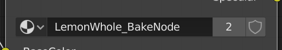
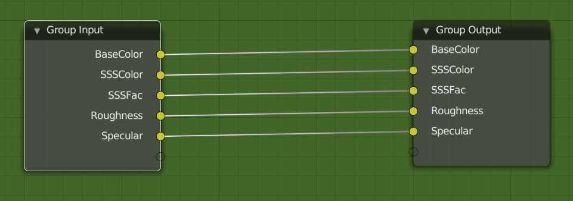
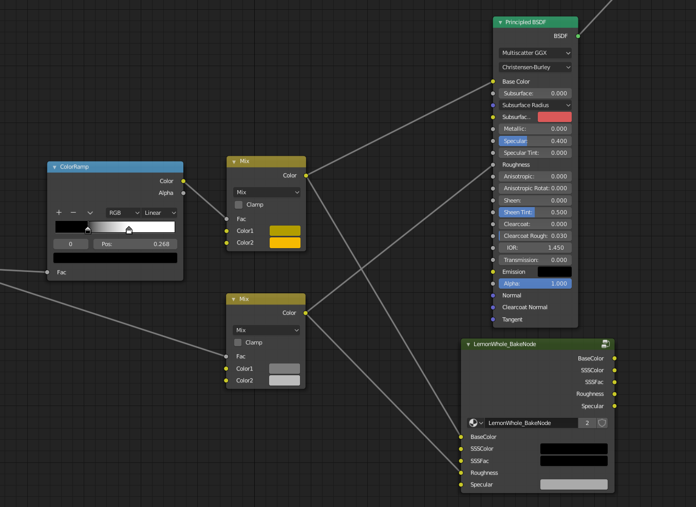

# render_bake_helper
Blender 2.8 addon helps users prepare their objects for baking.

## Why  
I created this because I was tired going through the ol' baking checklist:  
- Did I add an image node?
- Did I select it?
- Oh, I edited my material... is my image still selected?  

Repeat for each material your objects have.  

### Features
* Prepare Bake button that creates a BakeHelper image node and makes it active, so that your objects are ready to start baking!  
* BakeNode that quickly connects outputs to an emission node for baking.

## Install  
Download the repository, Clone or Download > Download ZIP (put it in a place where you can easily find it, like your desktop)  
In Blender's settings, go to the addons tab  
At the bottom, click "Install from File"  
Find where you put the ZIP file, select it, and click "Install from File"  

## Using  
Bake Helper is in Properties Window > Render Tab > Bake Helper Panel  
### Prepare Bake
When you want to bake, simply press the Prepare Bake button in the Bake Helper panel.  
Bake Helper will create its nodes under the Material Output node in the objects' materials and select them.

Change the Bake Helper node's settings, e.g. the image you'll be baking to, if you need to.

After that, the selected objects should be ready to bake.
### BakeNode  
  

BakeNode is simply a node group which has a name that ends with BakeNode, like LemonWhole_BakeNode.  

  
The idea is that you create a node group that has inputs going directly to outputs (it doesn't change the inputs in any way).  

  
Then you connect whatever you want to bake into this node group.  

When you want to bake the BakeNode outputs  
1. Select the BakeNode
2. You can easily connect BakeNode outputs by...
  * Right click BakeNode > Connect BakeNode Outputs
  * BakeHelper Panel > Connect BakeNode Outputs
  * Operator Search > Connect BakeNode Outputs
3. Select the output you want to bake  
4. Press Prepare Bake button in the Bake Helper Panel  
5. Bake!  
## Notes  
If a Bake Helper node was already created in your materials, pressing the Prepare Bake button *will not* overwrite them, it will just select them.

## Changelog  
### 0.6  
#### Features  
Added BakeNode feature  
Added Mini-Manual
### 0.5  
#### Features  
Added a Reset Node Image option to set the Bake Helper node's image back to the default Bake Helper image if it was changed to another image.  
#### Fixes  
Fixed trying to access UVs for object types that don't support UVs.  
Fixed trying to access the Bake Helper image when it doesn't exist.  
#### Rewriting
Changed many variable names to be more Pythonic.  
Changed class names to follow Blender guidelines more.  
